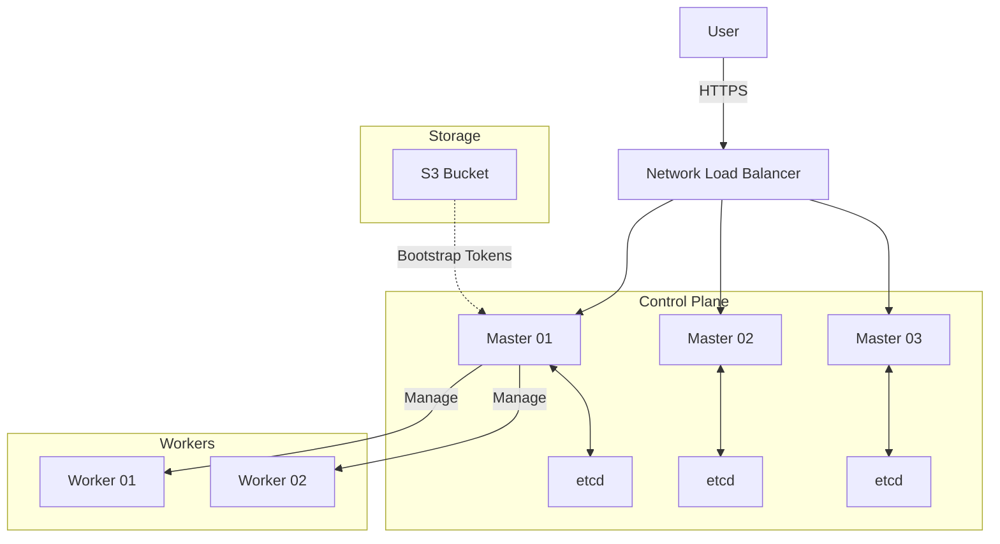

# HA Kubernetes Cluster on AWS (Terraform + Ansible)

[](https://github.com/OmarFathy22/HA-Kubernetes-Cluster-on-AWS-using-Terraform/actions/workflows/deploy-k8s-cluster.yml)

A production-ready, **High Availability Kubernetes Cluster** deployed on AWS using **Terraform**, **Ansible**, and **GitHub Actions**.

This project provides a fully automated pipeline to provision infrastructure, bootstrap a multi-master Kubernetes cluster, and deploy a secure Web Dashboard (**Headlamp**) with zero manual intervention.

---

## 🌟 Key Features

- **High Availability**: 3 Control Plane nodes (Stacked etcd) + Scalable Workers.
- **Zero-Touch Automation**: One-click deployment via GitHub Actions.
- **Visual Dashboard**: Integrated **Headlamp** UI for easy cluster management.
- **Security First**:
  - AWS OIDC Authentication (No long-lived AWS keys).
  - Encrypted Artifacts for sensitive tokens.
  - Private Networking with Calico CNI.

---

## 📜 Project Evolution (Versions)

This project has evolved through four distinct milestones. You can checkout specific tags to see the history:

| Version | Tag | Description |
| :--- | :--- | :--- |
| **v1.0** | `release/v1` | **Shell Scripts**: Initial stable version using Bash for automation. |
| **v2.0** | `release/v2` | **Ansible**: Complete refactor to Ansible Roles & Playbooks for idempotency. |
| **v3.0** | `release/v3` | **GitHub Actions**: Full CI/CD pipeline implementation. |
| **v4.0** | `release/v4` | **Headlamp Integration**: Added secure web dashboard & artifact encryption (Current). |

---

## 🚀 How to Deploy (GitHub Actions)

The **recommended** way to use this project is via the automated pipeline.

### 1. Prerequisites (Secrets)
Go to your Repository **Settings > Secrets and variables > Actions** and set these Secrets:

| Secret Name | Description |
| :--- | :--- |
| `K8S_CLUSTER_PRIVATE_KEY` | Your EC2 SSH Private Key (PEM format) for Ansible access. |
| `ARTIFACT_PASSWORD` | **Important**: Password used to encrypt the Dashboard Token artifact. |

*Note: The workflow uses AWS OIDC for authentication, so you need to configure the IAM Role in `.github/workflows/deploy-k8s-cluster.yml`.*

### 2. Run the Workflow
1. Go to the **Actions** tab.
2. Select **Deploy HA Kubernetes Cluster**.
3. Click **Run workflow**.
4. Configure options:
   - **Master/Worker Count**: Choose cluster size.
   - **Instance Types**: Cost/Performance options.
   - **Region**: AWS Region.
5. Watch the magic happen! ✨

### 3. Access the Dashboard
Once the deployment finishes:
1. **Get the Link**: Open the workflow logs, look at the **"Run Ansible Playbook"** step for:
   `🚀 DASHBOARD: http://<ip>:30000/c/main/token`
2. **Get the Token**:
   - Go to the **Summary** page of the run.
   - Download the **`headlamp-token-secure`** artifact.
   - Unzip it using your **`ARTIFACT_PASSWORD`**.
3. **Login**: Paste the token into Headlamp.

---

## 💻 Local Deployment (Legacy)

You can still run everything from your laptop if you have Terraform & Ansible installed.

```bash
# 1. Provision Infrastructure
cd terraform
terraform init
terraform apply -auto-approve

# 2. Generate Inventory
cd ../ansible
chmod +x generate-inventory.sh
./generate-inventory.sh ".."

# 3. Configure Kubernetes
ansible-playbook playbooks/site.yml
```

---

## 🏗️ Architecture



---

## 🔧 Tools Used

- **Terraform**: Infrastructure as Code (AWS EC2, VPC, NLB, IAM).
- **Ansible**: Configuration Management (Kubeadm, Containerd, Headlamp).
- **GitHub Actions**: CI/CD Orchestration.
- **Headlamp**: Kubernetes Web UI.
- **Calico**: CNI Plugin for Pod Networking.

---

## 📄 License
MIT License. Free to use and modify.
